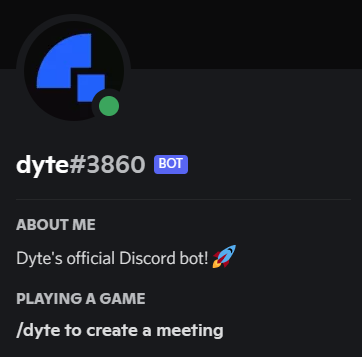

<!-- PROJECT LOGO -->
<!-- ALL-CONTRIBUTORS-BADGE:START - Do not remove or modify this section -->
[](#contributors-)
<!-- ALL-CONTRIBUTORS-BADGE:END -->
<p align="center">
  <a href="https://dyte.in">
    
  </a>

  <h3 align="center">discord-bot by dyte</h3>

  <p align="center">
    A Discord bot for Dyte's community Discord server.
    <br />
    <a href="https://github.com/dyte-in/discord-bot"><strong>Explore the docs »</strong></a>
    <br />
    <br />
    <a href="https://community.dyte.io">View Demo</a>
    ·
    <a href="https://github.com/dyte-in/discord-bot/issues">Report Bug</a>
    ·
    <a href="https://github.com/dyte-in/discord-bot/issues">Request Feature</a>
  </p>
</p>


<!-- TABLE OF CONTENTS -->
## Table of Contents

* [About the Project](#about-the-project)
  * [Built With](#built-with)
* [Getting Started](#getting-started)
  * [Prerequisites](#prerequisites)
  * [Installation](#installation)
* [Usage](#usage)
* [Roadmap](#roadmap)
* [Contributing](#contributing)
* [License](#license)
* [Contributors](#contributors-)


<!-- ABOUT THE PROJECT -->
## About The Project

A multi-purpose Discord bot for [Dyte's Discord Community](https://community.dyte.io).

</img>

### Built With

* [discord.js](https://discord.js.org/#/)
* [Typescript](typescriptlang.org/)


<!-- GETTING STARTED -->
## Getting Started

To get a local copy up and running follow these simple steps.

### Prerequisites

For running this bot, you would need to make create an application on Discord's developer portal, and create a bot in the application. Once this is done, you will receive the bot token, which you can use to run this project. You need to add your newly created bot to the Discord server you are going to use for testing.

Other prerequisites include:
* npm

### Installation
 
1. Clone the repo
```sh
git clone git@github.com:dyte-in/discord-bot.git
```
2. Install NPM packages
```sh
npm install
```
3. Create a `.env` from the sample `.env.example` and update the values
```sh
cp .env.example .env
```
4. Run the bot in developer mode using
```sh
npm run dev
```


<!-- USAGE EXAMPLES -->
## Usage

This bot can be used on [Dyte's Discord Community](https://community.dyte.io). For example, you can head to the `#bot-spam` channel and run `/dyte` or `$dyte` to create a new Dyte meeting.


<!-- ROADMAP -->
## Roadmap

See the [open issues](https://github.com/dyte-in/discord-bot/issues) for a list of proposed features (and known issues).


<!-- CONTRIBUTING -->
## Contributing

Contributions are what make the open source community such an amazing place to be learn, inspire, and create. Any contributions you make are **greatly appreciated**.

1. Fork the Project
2. Create your Feature Branch (`git checkout -b feature/AmazingFeature`)
3. Commit your Changes (`git commit -m 'feat: Add some AmazingFeature'`)
4. Push to the Branch (`git push -u origin feature/AmazingFeature`)
5. Open a Pull Request

You are requested to follow the contribution guidelines specified in [CONTRIBUTING.md](./CONTRIBUTING.md) while contributing to the project :smile:.

<!-- LICENSE -->
## License

Distributed under the MIT License. See [`LICENSE`](./LICENSE) for more information.


<!-- MARKDOWN LINKS & IMAGES -->
<!-- https://www.markdownguide.org/basic-syntax/#reference-style-links -->

## Contributors ✨

Thanks goes to these wonderful people ([emoji key](https://allcontributors.org/docs/en/emoji-key)):

<!-- ALL-CONTRIBUTORS-LIST:START - Do not remove or modify this section -->
<!-- prettier-ignore-start -->
<!-- markdownlint-disable -->
<table>
  <tr>
    <td align="center"><a href="https://github.com/roerohan"><br /><sub><b>Rohan Mukherjee</b></sub></a><br /><a href="https://github.com/dyte-in/discord-bot/commits?author=roerohan" title="Code">💻</a> <a href="https://github.com/dyte-in/discord-bot/commits?author=roerohan" title="Documentation">📖</a> <a href="#infra-roerohan" title="Infrastructure (Hosting, Build-Tools, etc)">🚇</a></td>
    <td align="center"><a href="https://github.com/thebongy"><br /><sub><b>Rishit Bansal</b></sub></a><br /><a href="https://github.com/dyte-in/discord-bot/commits?author=thebongy" title="Code">💻</a> <a href="https://github.com/dyte-in/discord-bot/commits?author=thebongy" title="Documentation">📖</a> <a href="#infra-thebongy" title="Infrastructure (Hosting, Build-Tools, etc)">🚇</a></td>
  </tr>
</table>

<!-- markdownlint-restore -->
<!-- prettier-ignore-end -->

<!-- ALL-CONTRIBUTORS-LIST:END -->

This project follows the [all-contributors](https://github.com/all-contributors/all-contributors) specification. Contributions of any kind welcome!